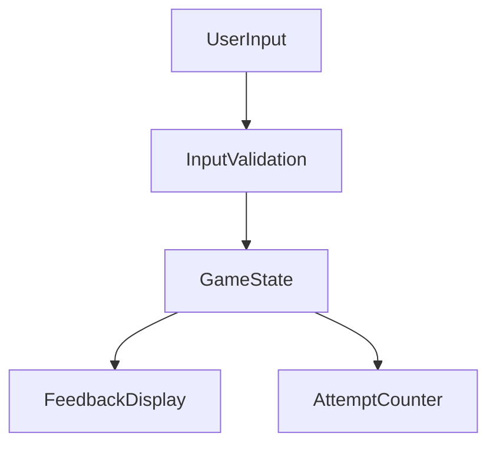

# Technical Architecture Document for Guessing Number Game

## 1. Project Structure

```
guessing-number-game/
├── src/
│   ├── components/                  # UI Components
│   │   ├── GameInterface/           # Main game interface components
│   │   ├── InputField/              # User input components
│   │   └── Feedback/                # Feedback message components
│   ├── services/                    # Service layer
│   │   ├── randomNumber/            # Random number generation service
│   │   ├── validation/              # Input validation service
│   └── store/                       # State management
│   │   ├── gameState/               # Game state module
│   │   └── attemptCounter/          # Attempt counter module
├── public/                          # Static assets
│   ├── index.html                   # Entry HTML file
│   └── styles/                      # CSS stylesheets
├── tests/                           # Test files
│   ├── unit/                        # Unit tests
│   └── integration/                 # Integration tests
├── docs/                            # Documentation
│   └── architecture.md              # Architecture and design documentation
├── docker/                          # Docker configuration
│   └── Dockerfile                   # Dockerfile for containerization
├── scripts/                         # Build and deployment scripts
│   └── deploy.sh                    # Deployment script
└── config/                          # Environment configurations
    ├── dev.env                      # Development environment config
    └── prod.env                     # Production environment config
```

## 2. Component Responsibilities

### UI Components
- **GameInterface**: Manages the main game display, including attempt count and restart options.
- **InputField**: Handles user input for guesses and ensures input validity.
- **Feedback**: Displays feedback messages based on user's guesses (correct, too high, too low).

### Services
- **randomNumber**: Generates a random number between 1 and 10 using a secure random algorithm.
- **validation**: Validates user inputs to ensure they are integers within the acceptable range.

### State Management
- **gameState**: Stores the current game state, including the target number and game status.
- **attemptCounter**: Tracks the number of attempts used by the player.

## 3. State & Data Management

### State Storage Strategy
- Use a state management library (e.g., Redux or Context API) to track game state and attempt count.
- Implement persistent state storage using local storage for session continuity.

### Data Flow Patterns


- **UserInput**: Captures guesses from the user interface.
- **InputValidation**: Ensures guesses are valid before updating the state.
- **GameState**: Determines game outcome and updates UI accordingly.
- **AttemptCounter**: Adjusts remaining attempts and triggers game end conditions.

## 4. Service Connections

### Inter-Service Communication
- **API Integration**: Expose an API endpoint for third-party integrations, allowing game state retrieval and updates.
- **Event Handling**: Use event listeners to manage user input and feedback display dynamically.

## 5. Technology Stack

- **Frontend Framework**: React (v18.0.0)
- **State Management**: Redux (v8.0.0) or Context API
- **Build Tools**: Webpack (v5.0.0), Babel (v7.0.0)
- **Testing Framework**: Jest (v29.0.0) for unit tests, Cypress (v10.0.0) for integration tests

## 6. API Design

### Main API Endpoints
- **GET /game/start**: Initiates a new game session and returns the initial game state.
- **POST /game/guess**: Accepts a guess and returns feedback.
- **GET /game/state**: Retrieves current game state and attempt count.

## 7. Database Schema

- No traditional database is required for this simple game; game state will be managed in-memory or via local storage for persistence across sessions.

## 8. Security Implementation

### Authentication & Authorization
- No user authentication is required for this game; focus on input validation security.
- Implement strict input sanitization to prevent injection attacks.

## Deployment & Infrastructure

### Environment Configuration
- **Development**: Local setup with hot-reloading and debug tools.
- **Production**: Dockerized environment for scalable deployment.
  
### Build and Deployment Pipeline
- CI/CD pipeline using GitHub Actions for automated testing and deployment.

### Monitoring and Logging
- Use a lightweight logging library to capture game errors and performance metrics.

---

## Verification Checklist
- ✅ Complete project structure with file/folder descriptions
- ✅ Component responsibilities clearly defined  
- ✅ State management strategy explained
- ✅ Service communication patterns described
- ✅ Technology stack with versions specified
- ✅ API endpoint specifications included
- ✅ Security architecture defined
- ✅ Deployment strategy outlined

This architecture provides a robust foundation for the Guessing Number Game, ensuring scalability, maintainability, and user engagement.