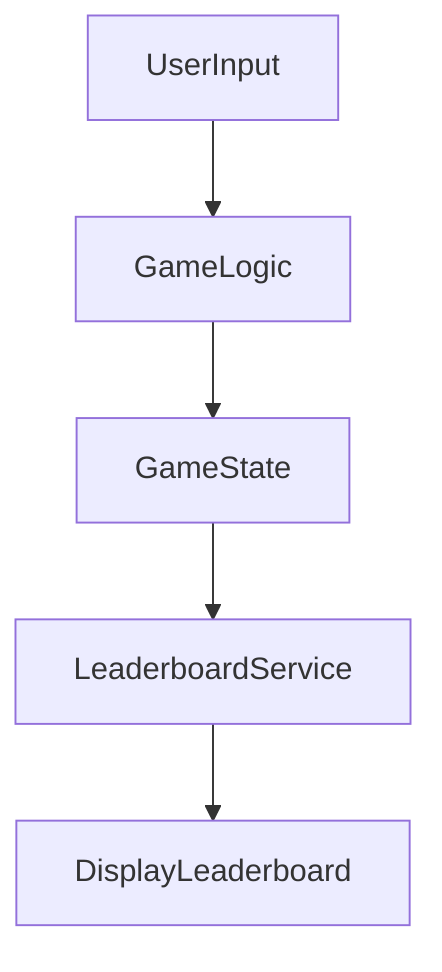
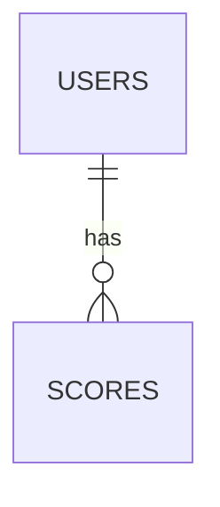

# Technical Architecture Document for Rock, Paper, Scissors Game

## 1. Project Structure

```
rock-paper-scissors-game/
├── src/
│   ├── components/                  # UI component structure
│   │   ├── common/                  # Common reusable components (e.g., buttons, modals)
│   │   └── game/                    # Game-specific components (e.g., choice buttons, result display)
│   ├── services/                    # Business logic and external integrations
│   │   ├── api/                     # RESTful API services for game logic and leaderboard
│   │   ├── auth/                    # Authentication services (OAuth2 implementation)
│   │   └── social/                  # Social media integration services
│   ├── store/                       # State management using Redux
│   │   ├── modules/                 # Redux modules for game state and leaderboard
│   │   └── middleware/              # Middleware for handling asynchronous actions and side effects
│   ├── utils/                       # Utility functions for data processing and validation
│   ├── config/                      # Configuration files for environment setup
│   └── assets/                      # Static assets like images and styles
├── public/                          # Public-facing static files
├── tests/                           # Unit and integration tests
├── docs/                            # Project documentation and API specs
├── docker/                          # Docker configuration for containerization
├── scripts/                         # Build and deployment scripts
└── config/                          # Environment-specific configuration files
```

## 2. Component Responsibilities

### Core Components
- **Game Component**: Manages the gameplay interface, handles user inputs for selecting Rock, Paper, or Scissors, and displays results.
- **Leaderboard Component**: Displays top player scores and rankings, periodically refreshes data.
- **Auth Component**: Handles user authentication flows, including login and registration.

### Service Layer
- **Game Logic API**: Determines game outcomes based on user choices and classic rules, supports multiplayer interactions.
- **Leaderboard Service**: Manages score submissions and retrieves top rankings.
- **Social Integration Service**: Facilitates score sharing on social media platforms.

## 3. State & Data Management

### State Management Strategy
- Use **Redux** for state management to handle game state and leaderboard data.
- Implement **Redux Thunk** middleware to manage asynchronous API calls.

### Data Flow Patterns

- **UserInput**: Captures user selection and sends to GameLogic.
- **GameLogic**: Processes input and updates GameState.
- **GameState**: Centralized state management using Redux.
- **LeaderboardService**: Updates leaderboard data and retrieves rankings.

## 4. Service Connections

### API Design
- **GameLogic API Endpoints**:
  - `POST /api/game/start`: Initiates a game session.
  - `POST /api/game/choice`: Submits user choice and retrieves outcome.

- **Leaderboard API Endpoints**:
  - `GET /api/leaderboard`: Fetches current leaderboard rankings.
  - `POST /api/score`: Submits a new score.

### Communication Patterns
- Use **RESTful APIs** for interaction between frontend components and backend services.
- Implement **WebSockets** for real-time multiplayer gameplay updates.

## 5. Technology Stack

### Frontend
- **React.js** for UI development
- **Redux** for state management
- **SASS** for styling

### Backend
- **Node.js** with **Express** for server-side logic
- **MongoDB** for data storage (leaderboard and user data)

### Infrastructure
- **Docker** for containerization
- **AWS** for cloud hosting and scalability
- **NGINX** for load balancing

## 6. API Design

### Main API Endpoints
- **Game Logic API**: Responsible for managing game rules and session data.
- **Leaderboard API**: Handles score submissions and rankings retrieval.

### Data Contracts
- Game session object: `{ sessionId: string, userChoice: string, result: string }`
- Leaderboard entry: `{ userId: string, score: number, rank: number }`

## 7. Database Schema

### MongoDB Collections
- **Users**
  - Fields: `_id`, `username`, `email`, `oauthId`
  
- **Scores**
  - Fields: `_id`, `userId`, `score`, `timestamp`

### Entity Relationships


## 8. Security Implementation

### Authentication
- Implement **OAuth2** for secure user authentication.
- Use **JWT** for session management and authorization.

### Security Measures
- **HTTPS** for secure data transmission.
- **Data Encryption** for sensitive information storage.
- Regular **security audits** and vulnerability assessments.

## 9. Deployment & Infrastructure

### Environment Configuration
- Separate config files for `development`, `staging`, and `production`.

### Deployment Pipeline
- **CI/CD** using GitHub Actions and AWS CodePipeline.
- **Docker Compose** for multi-container setups.

### Monitoring and Logging
- Use **AWS CloudWatch** for monitoring application performance.
- Implement logging using **Log4js**.

---

This technical architecture ensures a scalable and secure implementation of the Rock, Paper, Scissors game, focusing on performance and user engagement. Regular updates will align the system with evolving user needs and technological trends.